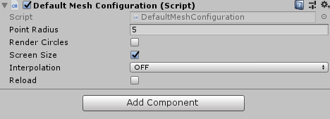

# BA_PointCloud
PointCloud-BachelorThesis

Project files for my bachelor thesis on rendering large point clouds in Unity.

## Ressources
Please refer to the code documentation for details about the classes and scripts (Folder "/doc").
For details about the algorithms please refer to the bachelor thesis (https://www.cg.tuwien.ac.at/research/publications/2017/FRAISS-2017-PCU/).
Below you will find a Getting-Started-Guide

Download the current version: https://github.com/SFraissTU/BA_PointCloud/raw/master/release/BAPC-v01.02.unitypackage

## Change Log
### Version 1.2 (19.02.2019):
* Did some renaming and made some components easier to use.
  * All the packages are subpackages of "BAPointCloudRenderer"
  * There is a new package "BAPointCloudRenderer.CloudController" containing new versions of the classes from the  old "Controllers"-package
  * "AbstractPointSetController", "CloudsFromDirectoryLoader", "DynamicLoaderController", "PointCloudLoaderController" and "PointCloudSetRealTimeController" are now deprecated. Please use "AbstractPointCloudSet", "DirectoryLoader", "PointCloudLoader", "StaticPointCloudSet" and "DynamicPointCloudSet" respectively instead.
  * "GeoQuadMeshConfiguration" and "Quad4PointMeshConfiguration" are now deprecated. Please use "DefaltMeshConfiguration" instead.
* Created a new Point Cloud Set type for simple one-time loading and rendering of small point clouds: StaticPointCloudSet
* You can now add new point clouds to the sets when the project is already running. Simply create a Point Cloud Loader object and specify the corresponding Point Cloud Set. It's also possible now to create a Loader in the editor without it being loaded at the beginning of the application. By setting "loadOnStart" to false, you can call "LoadPointCloud" later to load it on demand.
* The renderer-objects now provide better functions for pausing and continuing rendering.
* Small bug fixings and improvements
* The project is now available as a .unitypackage-file, so you don't have to download the whole project anymore.

### Future
Features that may or may not come in the future (Right now, I do this in my leisure time, so I cannot work a lot on it):
* Eye-Dome-Lighting
* Adaptive Point Sizes
* Test WebGL/VR-Support
* Loading Point Clouds from the Resources-folder
* laz-support
* PointCloud-preview in editor
* PointCloud-transformations

Feel free to send me feedback! It's great to see that many people are using this project!

## Getting Started
Here's a short tutorial on how to display your own cloud in the project.
1. Download the current .unitypackage file here: https://github.com/SFraissTU/BA_PointCloud/raw/master/release/BAPC-v01.02.unitypackage
2. If your point cloud is not in the Potree format yet, you first have to convert it. Head over to https://github.com/potree/PotreeConverter/releases, download the PotreeConverter and convert your cloud into the Potree format. For testing purposes you can also try the converted lion-pointcloud, which is available here: https://github.com/SFraissTU/BA_PointCloud/raw/master/release/lion.zip
3. Create a new project and go to Assets->Import Package and import the downloaded .unitypackage-file.
4. There is now a BAPC-Example-scene in the project. You can either use that or follow the steps below in your own scene to get the same result.
5. If you want to be able to navigate the camera through the scene, I provide a small script for camera controls. This is optional and you can also just use your own control mechanisms instead. Select the Main Camera in the Scene Graph and press "Add Component" in the Inspector. Choose "Scripts"->"BAPointCloudRenderer.Controllers"->"Camera Controllers". When you start the game, you can then move the camera around by using the mouse and the WASD-keys as well as EQ for moving up and down, LeftShift for moving with higher speed and C for moving with lower speed. You can set the normal speed in the Inspector.
6. Now we have to create a Point Cloud Set. A Point Cloud Set manages several point clouds in the scene. The point clouds belonging to a set can either be specified in the editor or can be created while the application is running. To create a set, right click in the Scene Graph and select "Create Empty". Name this object "Point Cloud Set" or something similar. Press "Add Component" in the Inspector and select "Scripts"->"BAPointCloudRenderer.CloudController". Here you have to options:
  * "Static Point Cloud Set": Useful for small point clouds, where you want to ensure that all points are rendered. Simply loads all the points into the memory and displays them. Might take some time to load. Not useful for big point clouds.
  * "Dynamic Point Cloud Set": Only loads and displays the points necessary for the current camera position. Useful for big point clouds. Has a bunch of options, such as point budget (the maximum number of points to render at once), minimum projected octree node size, cache size etc.
For this tutorial, I suggest using a Dynamic Point Cloud Set. Regardless of your choice, you will have at least two configurations in the editor now: "Move Center To Transform Position": If this is set to true, the center of the point cloud is translated to the position specified in the Transform-Component of this GameObject. However this only applies if the point cloud is loaded at the beginning of the scene and not added afterwards. The second configuration is a "Mesh Configuration", which specifies how the points should be rendered. This will be done in the next step.

7. Let's create a MeshConfiguration. This will determine how the point cloud will be rendered. Right click in the Scene Graph and select "Create Empty". Name this object "MeshConfiguration" or something similar. Press "Add Component" in the Inspector and select "Scripts"->"BAPointCloudRenderer.ObjectCreation". There are several options here, but some of them are deprecated. You can use "Point Mesh Configuration" if you want each point to be displayed as a simple pixel on a screen. If you want your points to be rendered in another way or want to experiment with different options, please use "Default Mesh Configuration". This enables you to specify a point size (in pixels or world units, depending on the checkbox "Screen Size"), to render points as quads or circles and also to use interpolation modes. The "reload" property should be set to true to apply changes you make to these configurations while the application is running.
Now, go to the Point Cloud Set and choose the created configuration as your MeshConfiguration.

8. Now let's create a Point Cloud Loader: Create a new Empty object and name it "Cloud Loader" or something similar. Click on "Add Component" and select "Scripts"->"BAPointCloudRenderer.CloudController"->"PointCloudLoader". With this object you can load a single point cloud and attach it to the created point cloud set. As "Cloud Path" specify the path to the point cloud folder (specifically the folder containing the cloud.js-file). Please note that this is a path relative to the execution directory. The point cloud is not used as a resource-asset in this project.

As "Set Controller" choose the previously created Point Cloud Set. If "Load On Start" is checked, the cloud is loaded as soon as the application is executed, otherwise you will have to call the function "LoadPointCloud" when you want the cloud to start loading.
Alternatively to the Point Cloud Loader you can also use a Directory Loader. Here you specify the path to a folder containing several point cloud folders which should all be loaded. Internally, this just creates several Point Cloud Loaders. 

9. Press the Play-Button!

