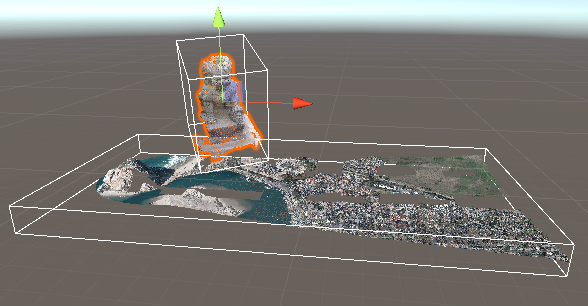
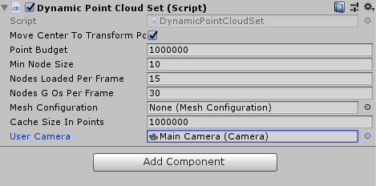
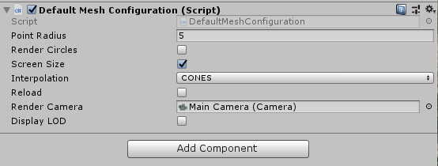
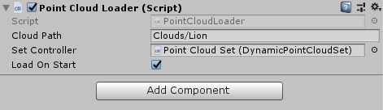
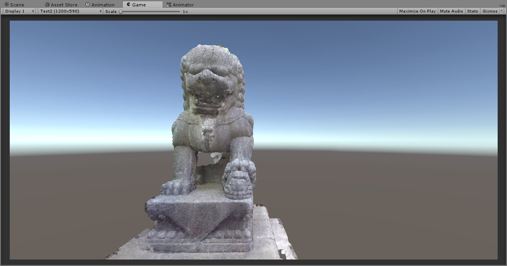
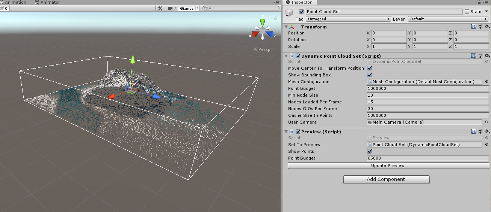
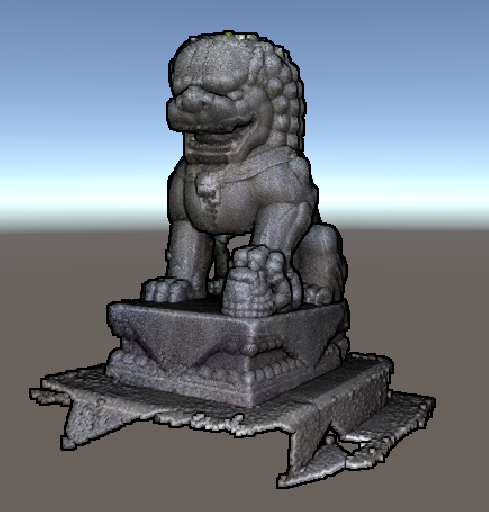

# BA_PointCloud
PointCloud-BachelorThesis

Project files for my bachelor thesis on rendering large point clouds in Unity.

## Ressources
Please refer to the code documentation for details about the classes and scripts (Folder "/doc").
For details about the algorithms please refer to the bachelor thesis (https://www.cg.tuwien.ac.at/research/publications/2017/FRAISS-2017-PCU/).
Below you will find a Getting-Started-Guide

Download the current version: https://github.com/SFraissTU/BA_PointCloud/releases/

## Change Log
### Version 1.5 (30.11.2020):
Changes provided by user [Adrien Gressin](https://github.com/agressin):
* Support for Potree Format V1.8 (Created by Potree Converter 1.7)
* Path to pointcloud can now be an URL. In that case, the pointcloud will be downloaded to a folder "temp".

### Version 1.4 (04.04.2020):
A small update with bugfixes and minor improvements.

Change list:
* Easier support for Streaming Assets in Point Cloud Loader and Directory Loader. If "Streaming Assets As Root" is set to true, the path is relative to the streaming assets directory (code provided by Pablo Vidaurre).
* Moved "Hide" and "Display" buttons from Preview object to Dynamic Point Cloud Set.
* Fixed "PointCloudLoader.LoadPointCloud()" sometimes not working when "Load on Start" is set to False.
* Added GUI-Buttons in Point Cloud Loader for loading and removing point cloud at runtime.

### Version 1.3 (20.10.2019):
This update contains a lot of new features, especially previewing the point cloud in the editor, applying complex transformations to point clouds and eye dome lighting!

Detailed change list:
* A Preview-Script is available which allows you to see the bounding box and a coarse preview of the point cloud inside the editor!
* Transformation of Point Cloud Set gets applied to the whole point cloud, as the created Node-GameObjects are now children of the set.
* Eye Dome Lighting (provided by Kazys Stepanas)
* Point Cloud Sets now provide the option to display the (tight) bounding box of the point clouds as a Gizmo
* DefaltMeshConfiguration and PointMeshConfiguration now provide the option to display the current LOD-Bounding Boxes
* The MoveCenterToTransform-Functionality now uses the tight bounding box instead of the wide one, so the objects should seem more centered
* DirectoryLoader doesn't run during runtime anymore but is a tool for the editor, which you can use to create several PointCloudLoaders there by pressing a button in the editor.
* DefaultMeshConfiguration now also requires a camera to be used. Before it always took the default one, which might not always be what you want.
* Project Update to Unity 2019
* Fixed changing "MoveCenterToTransform" sometimes leading to an exception
* Provided Mac-Os-Compability by replacing "\\" with "/"
* Deleted old obsolete Controller-classes
* Tested VR-Support with HTC Vive

  

### Version 1.2 (19.02.2019):
* Did some renaming and made some components easier to use.
  * All the packages are subpackages of "BAPointCloudRenderer"
  * There is a new package "BAPointCloudRenderer.CloudController" containing new versions of the classes from the  old "Controllers"-package
  * "AbstractPointSetController", "CloudsFromDirectoryLoader", "DynamicLoaderController", "PointCloudLoaderController" and "PointCloudSetRealTimeController" are now deprecated. Please use "AbstractPointCloudSet", "DirectoryLoader", "PointCloudLoader", "StaticPointCloudSet" and "DynamicPointCloudSet" respectively instead.
  * "GeoQuadMeshConfiguration" and "Quad4PointMeshConfiguration" are now deprecated. Please use "DefaltMeshConfiguration" instead.
* Created a new Point Cloud Set type for simple one-time loading and rendering of small point clouds: StaticPointCloudSet
* You can now add new point clouds to the sets when the project is already running. Simply create a Point Cloud Loader object and specify the corresponding Point Cloud Set. It's also possible now to create a Loader in the editor without it being loaded at the beginning of the application. By setting "loadOnStart" to false, you can call "LoadPointCloud" later to load it on demand.
* The renderer-objects now provide better functions for pausing and continuing rendering.
* Small bug fixings and improvements
* The project is now available as a .unitypackage-file, so you don't have to download the whole project anymore.

Please note that because of the restructuring, the project is not fully compatible with previous versions. If you want to update your project, you need to do a bit of refactoring, as the namespaces and paths to the files have changed.

### Future
I maintain this project in my free time, so I ask for understanding that I do not have time to build many new features, and I apologize if some Github-Issues remain unanswered.
If you want to contribute something to this project, please feel free to do so. Contact me or just commit a pull request!
Features that may or may not come in the future, by me or someone else:
* Support for Potree Format 2.0
* Adaptive Point Sizes
* Better WebGL-Support
* On-Demand-Hierarchy-Loading
* Loading Point Clouds from the Resources-folder
* laz-support
* More flexible Point Cloud Transformations. Transforming single clouds instead of the whole set.

## Example Scenes
* DynamicDemo.unity: Demonstrates DynamicPointCloudSet and Preview on the Lion-Point-Cloud
* StaticDemo.unity: Demonstrates StaticPointCloudSet and Preview on the Lion-Point-Cloud
* EDLDemo.unity: Demonstrates DynamicPointCloudSet and EDL on the Lion-Point-Cloud
* BigSceneDemo.unity (GitHub-Repo only): Demonstrates DynamicPointCloudSet with several clouds from the CA13-Point Cloud.

## Getting Started
Here's a short tutorial on how to display your own cloud in the project.
1. Download the current .unitypackage file here: https://github.com/SFraissTU/BA_PointCloud/releases/
2. If your point cloud is not in the Potree format yet, you first have to convert it. Head over to https://github.com/potree/PotreeConverter/releases, download the PotreeConverter (version 1.7 or lower!) and convert your cloud into the Potree format. For testing purposes you can also try the converted lion-pointcloud, which is available here: https://github.com/SFraissTU/BA_PointCloud/raw/master/release/lion.zip . Alternatively, you also find a set of big point clouds in the git repository.
3. Create a new project and go to Assets->Import Package and import the downloaded .unitypackage-file.
4. There is now a DynamicDemo-Scene in the project. You can either use that or follow the steps below in your own scene to get the same result.
5. If you want to be able to navigate the camera through the scene, I provide a small script for camera controls. This is optional and you can also just use your own control mechanisms instead. Select the Main Camera in the Scene Graph and press "Add Component" in the Inspector. Choose "Scripts"->"BAPointCloudRenderer.Controllers"->"Camera Controllers". When you start the game, you can then move the camera around by using the mouse and the WASD-keys as well as EQ for moving up and down, LeftShift for moving with higher speed and C for moving with lower speed. You can set the normal speed in the Inspector.
6. Now we have to create a Point Cloud Set. A Point Cloud Set manages several point clouds in the scene. The point clouds belonging to a set can either be specified in the editor or can be created while the application is running. To create a set, right click in the Scene Graph and select "Create Empty". Name this object "Point Cloud Set" or something similar. Press "Add Component" in the Inspector and select "Scripts"->"BAPointCloudRenderer.CloudController". Here you have to options:
  * "Static Point Cloud Set": Useful for small point clouds, where you want to ensure that all points are rendered. Simply loads all the points into the memory and displays them. Might take some time to load. Not useful for big point clouds.
  * "Dynamic Point Cloud Set": Only loads and displays the points necessary for the current camera position. Useful for big point clouds. Has a bunch of options, such as point budget (the maximum number of points to render at once), minimum projected octree node size, cache size etc.
For this tutorial, I suggest using a Dynamic Point Cloud Set. Regardless of your choice, you will have at least two configurations in the editor now: "Move Center To Transform Position": If this is set to true, the center of the point cloud is translated to the position specified in the Transform-Component of this GameObject. However this only applies if the point cloud is loaded at the beginning of the scene and not added afterwards. The second configuration is a "Mesh Configuration", which specifies how the points should be rendered. This will be done in the next step.

7. Let's create a MeshConfiguration. This will determine how the point cloud will be rendered. Right click in the Scene Graph and select "Create Empty". Name this object "MeshConfiguration" or something similar. Press "Add Component" in the Inspector and select "Scripts"->"BAPointCloudRenderer.ObjectCreation". There are several options here, but some of them are deprecated. You can use "Point Mesh Configuration" if you want each point to be displayed as a simple pixel on a screen. If you want your points to be rendered in another way or want to experiment with different options, please use "Default Mesh Configuration". This enables you to specify a point size (in pixels or world units, depending on the checkbox "Screen Size"), to render points as quads or circles and also to use interpolation modes. The "reload" property should be set to true to apply changes you make to these configurations while the application is running.
The option "Display LOD" displays the bounding boxes of the loaded Octree-Nodes. If you use a Default Mesh Configuration, you also have to set the Render Camera, which should be the same one you specified in the Point Cloud Set.
Now, go to the Point Cloud Set and choose the created configuration as your MeshConfiguration.

8. Now let's create a Point Cloud Loader: Create a new Empty object and name it "Cloud Loader" or something similar. Click on "Add Component" and select "Scripts"->"BAPointCloudRenderer.CloudController"->"PointCloudLoader". With this object you can load a single point cloud and attach it to the created point cloud set. As "Cloud Path" specify the path to the point cloud folder (specifically the folder containing the cloud.js-file). Please note that this is either an absolute path or a path relative to the execution directory. The point cloud is not used as a resource-asset in this project.

As "Set Controller" choose the previously created Point Cloud Set. If "Load On Start" is checked, the cloud is loaded as soon as the application is executed, otherwise you will have to call the function "LoadPointCloud" when you want the cloud to start loading.
Alternatively to the Point Cloud Loader you can also use a Directory Loader. Here you specify the path to a folder containing several point cloud folders which should all be loaded. If you then press the "Load Directory"-Button in the editor, a Point Cloud Loader will be created for each point cloud in that folder.

9. Press the Play-Button!

## Special Topics
### Preview
To get a preview of your scene inside the editor, please create a "Preview"-Component (in BAPointCloudRenderer.CloudController). Choose the set that you want to preview.
By default, the preview object will simply display the bounding box of the point cloud set in the editor (Gizmos have to be enabled - may only be visible in the editor). If you also want to load points, please activate the checkbox "Show Points".
You can also specify a Point Budget, which is the maximum number of points to display. This value shouldn't be too high, in order not to crash the editor when using very large point clouds. Please note, that less points than this value might be loaded, as only the first level of the octree hierarchy is considered.
The preview is not refreshed automatically when you add or remove point clouds, so please use the "Update Preview"-Button in the editor when you make changes.

Previewing is also displayed in the demo scenes DynamicDemo and StaticDemo.

### Eye-Dome-Lighting
To use Eye-Dome-Lighting (thanks to [Kazys Stepanas](https://github.com/KazNX) for implementing it!), a good lighting model for point clouds, especially when they don't have color information, please refer to the setup in the scene EDLDemo.

You need to create two cameras. Create a view camera, which is tagged as MainCamera with the ViewCamera-script attached. This is the camera you want to move through the scene.
Additionally, you need a post processing camera, to which you attach the Edl Camera script. As "Edl Shader" choose EDL and as "Edl Off Shader" choose "ScreenBlit". Edl should then work:

Please note that there's a bug when using EDL and the "Display LOD"-functionality in the MeshConfiguration. It displays the bounding boxes twice: Once in the scene, once in front of the camera. This may or may not be fixed in a future version.

## FAQ and Trouble-Shooting

#### Does this work with VR?
Yes. I've tested it with an HTC Vive and it worked fine. If you use SteamVR, just create a CameraRig-object and pass the child camera of it to the Point Cloud Set (and the DefaltMeshConfiguration).

It might be a bit tricky to use EDL with VR. I don't really know how to do that.

#### Does this work with WebGL?
Apparently there have been some troubles using this project for WebGL. Another user has been trying to make it work. See this thread for more information: https://github.com/SFraissTU/BA_PointCloud/issues/12
In general, if you want to render your point clouds in the browser, I recommend Potree: http://potree.org/

### What about point attributes other than color?
Not possible at the moment. Intensity values are loaded into the program, but they are currently not used. Depending on what you need, it might be possible to implement this yourself.

### Which Potree Converter version does this support?
This should work with point clouds created with Potree Converter up to version 1.7 (Potree format 1.8). Files created from Potree Converter 2.0 are currently not supported.

#### Anything else?
Please send me an email or open a github issue. Please note that I don't have a lot of time to work for this project, so I might not be able to fulfill every request, but I'm open to suggestions.
